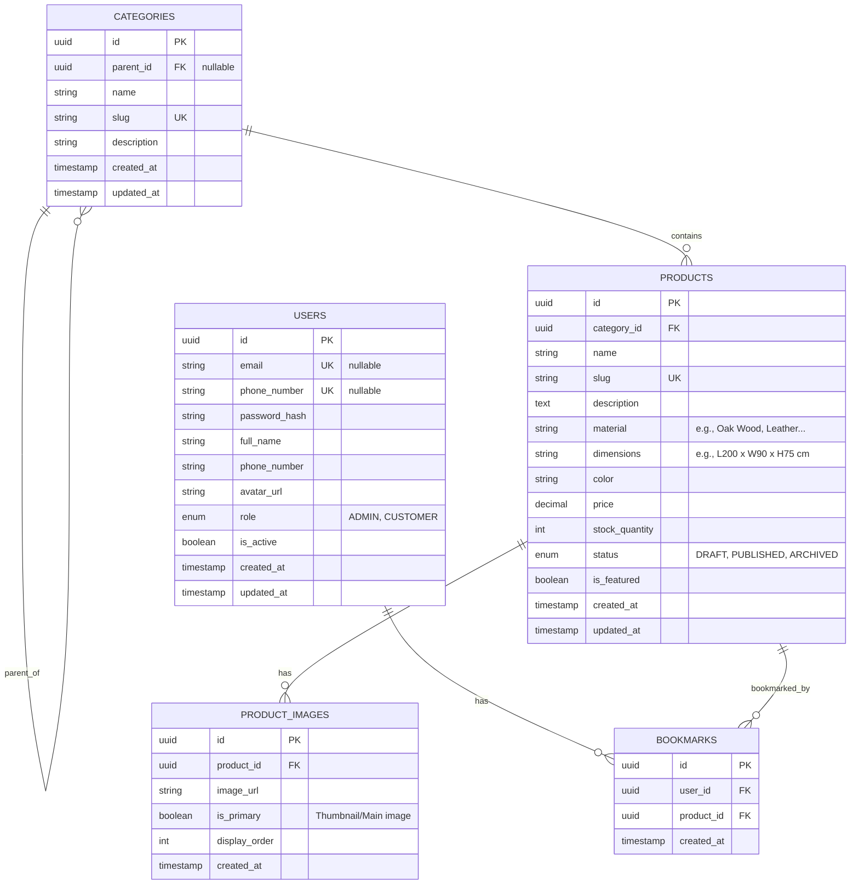

# Database Schema Design - KL Interiors

This document describes the database design for the interior furniture e-commerce website. The design fulfills current requirements (User, Product, and Bookmark management) and is structured for easy future scalability (e.g., Payments, Cart, Orders, Product Variants).

## 1. Entity-Relationship Diagram (ERD)

## 2. Table Details

### 2.1. `users` Table (User Management)

Stores authentication and profile information for users (Customer, Admin).

| Column          | Type      | Constraints                  | Description                     |
| :-------------- | :-------- | :--------------------------- | :------------------------------ |
| `id`            | UUID      | PK                           | Primary Key                     |
| `email`         | VARCHAR   | UNIQUE, NULL                 | User's email address            |
| `password_hash` | VARCHAR   | NOT NULL                     | Encrypted password (Bcrypt)     |
| `full_name`     | VARCHAR   | NOT NULL                     | User's full name                |
| `phone_number`  | VARCHAR   | UNIQUE, NULL                 | Contact phone number            |
| `avatar_url`    | VARCHAR   | NULL                         | Avatar image URL                |
| `role`          | VARCHAR   | NOT NULL, DEFAULT 'CUSTOMER' | Role: `ADMIN`, `CUSTOMER`       |
| `is_active`     | BOOLEAN   | DEFAULT TRUE                 | Account status (Active/Blocked) |
| `created_at`    | TIMESTAMP | DEFAULT NOW()                | Creation timestamp              |
| `updated_at`    | TIMESTAMP | AUTO UPDATE                  | Last modification timestamp     |

### 2.2. `categories` Table (Product Categories)

Manages furniture categories (e.g., Living Room, Tables, Sofas). Supports a recursive structure (Parent-Child) for nested multi-level categories.

| Column        | Type      | Constraints                | Description                                 |
| :------------ | :-------- | :------------------------- | :------------------------------------------ |
| `id`          | UUID      | PK                         | Primary Key                                 |
| `parent_id`   | UUID      | FK -> categories(id), NULL | Parent category identifier (if any)         |
| `name`        | VARCHAR   | NOT NULL                   | Category name (e.g., Sofa)                  |
| `slug`        | VARCHAR   | UNIQUE, NOT NULL           | SEO-friendly URL slug (e.g., leather-sofas) |
| `description` | TEXT      | NULL                       | Category description                        |
| `created_at`  | TIMESTAMP | DEFAULT NOW()              |                                             |
| `updated_at`  | TIMESTAMP | AUTO UPDATE                |                                             |

### 2.3. `products` Table (Furniture Products)

Contains core furniture product information. Includes furniture-specific fields such as Material and Dimensions.

| Column           | Type      | Constraints          | Description                             |
| :--------------- | :-------- | :------------------- | :-------------------------------------- |
| `id`             | UUID      | PK                   | Primary Key                             |
| `category_id`    | UUID      | FK -> categories(id) | Associated category                     |
| `name`           | VARCHAR   | NOT NULL             | Product Name                            |
| `slug`           | VARCHAR   | UNIQUE, NOT NULL     | Standardized SEO slug                   |
| `description`    | TEXT      | NULL                 | Detailed description (HTML/Rich Text)   |
| `material`       | VARCHAR   | NULL                 | Primary manufacturing material          |
| `dimensions`     | VARCHAR   | NULL                 | Specific size tracking (L x W x H)      |
| `color`          | VARCHAR   | NULL                 | Color label                             |
| `price`          | DECIMAL   | NOT NULL, >= 0       | Retail price                            |
| `stock_quantity` | INT       | NOT NULL, DEFAULT 0  | Inventory level tracking                |
| `status`         | VARCHAR   | DEFAULT 'DRAFT'      | State: `DRAFT`, `PUBLISHED`, `ARCHIVED` |
| `is_featured`    | BOOLEAN   | DEFAULT FALSE        | Featured flag for homepage showcasing   |
| `created_at`     | TIMESTAMP | DEFAULT NOW()        |                                         |
| `updated_at`     | TIMESTAMP | AUTO UPDATE          |                                         |

> **Scalability Note**: If future requirements demand **Product Variants** (e.g., a chair featuring multiple color/size configurations with differing prices), we can easily introduce a `product_variants` table referencing `products(id)` without rebuilding existing architecture.

### 2.4. `product_images` Table (Product Media)

Visual representation is critical for furniture. Products often require 5-10 images from various angles.

| Column          | Type      | Constraints                 | Description                              |
| :-------------- | :-------- | :-------------------------- | :--------------------------------------- |
| `id`            | UUID      | PK                          | Primary Key                              |
| `product_id`    | UUID      | FK -> products(id), CASCADE | Linked product                           |
| `image_url`     | VARCHAR   | NOT NULL                    | Image storage path (S3/Cloudinary/Local) |
| `is_primary`    | BOOLEAN   | DEFAULT FALSE               | Main representation/thumbnail flag       |
| `display_order` | INT       | DEFAULT 0                   | Slider/gallery sorting order             |
| `created_at`    | TIMESTAMP | DEFAULT NOW()               |                                          |

### 2.5. `bookmarks` Table (Saved Products)

"Wishlist" / "Bookmark" functionality bridging users and their preferred furniture pieces.

| Column       | Type      | Constraints                 | Description      |
| :----------- | :-------- | :-------------------------- | :--------------- |
| `id`         | UUID      | PK                          | Primary Key      |
| `user_id`    | UUID      | FK -> users(id), CASCADE    | Bookmarking user |
| `product_id` | UUID      | FK -> products(id), CASCADE | Saved product    |
| `created_at` | TIMESTAMP | DEFAULT NOW()               | Action timestamp |

_(Best practice dictates a Composite Unique Index on `[user_id, product_id]` preventing duplicate bookmarks)._

## 3. Architecture Rationale for an Interior E-Commerce App

1. **Priority on Visual Showcase**: Interior items demand explicitly detailed descriptions (`material`, `dimensions`, `color`) coupled with robust media arrays (split into `product_images`) answering the customer's need for comprehensive spatial visualization.
2. **SEO Dominance**: Integrating `slug` columns directly into `categories` and `products` facilitates organic routing (`/category/living-room/italian-leather-sofa`).
3. **Frictionless Future E-Commerce Expansion**:
   - Cart Module: Deploy `carts` and `cart_items` cleanly.
   - Payment Pipeline: Implement `orders`, `order_items`, `payments`. Foreign keys binding to `products(id)` maintain perfect isolation without technical debt.
   - Distinct Models: Handled via specialized `product_variants`.
4. **Performance & Authentication Ecosystem**: Proper RBAC handled via `users` table roles. The `bookmarks` table acts as a standard Many-to-Many resolution layer, fetching ultra-fast indices directly linked to user scope.

## 4. Following PostgreSQL Database Design Best Practices (From README.md)

This schema strictly adheres to the PostgreSQL Database Design best practices outlined in Section 5 of the project's `README.md`:

### 4.1. Normalization vs Denormalization (Section 5.1)

- **Strict Normalization**: The image assets are purposely separated entirely into the `product_images` table (rather than storing raw string arrays within products), conforming securely to **1NF/2NF/3NF** guidelines.
- **Multi-to-Multi Bridging**: The `bookmarks` table logically acts as the standard bridging resolution to correctly resolve the tricky Many-to-Many dependency between Users and Products without compromising relational integrity.

### 4.2. Integrity Constraints (Section 5.2)

- **Primary Keys**: The system forces UUIDs on all tables enforcing unbreakable identity parameters (preventing trivial ID-guessing vulnerabilities).
- **Uniqueness**: Enforcing hard `UNIQUE` constraints upon identity drivers like `users.email`, `users.phone_number`, and critical URI paths like `slug` properties.
- **Relational Cascading**: Leveraging PostgreSQL `CASCADE` behaviors cleanly onto associative tables like `product_images` (`FK -> products(id), CASCADE`) and `bookmarks` ensuring safe metadata lifecycle destruction (preventing dangling data orphans).

### 4.3. Indexing Strategy (Section 5.3)

Governed by target query expectations (to be fully realized natively within SQLAlchemy/Alembic deployments):

- **B-tree Indexes**: Anticipated across universally heavily "Filtered/Where" columns such as: `categories.slug`, `products.slug` (allowing instant Web-Router mapping), `products.category_id`, and `users.email`.
- **Composite Unique Index**: Enforced upon `(user_id, product_id)` within the `bookmarks` table specifically designed to block duplicate entries natively while offering rapid O(1) matching.
